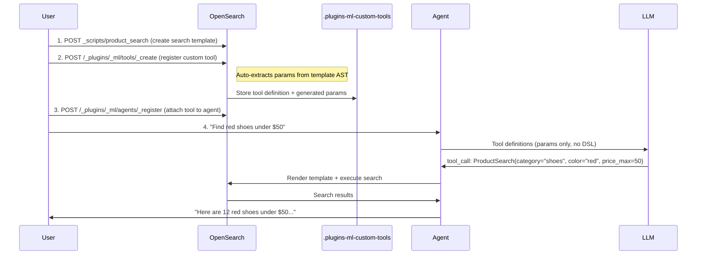
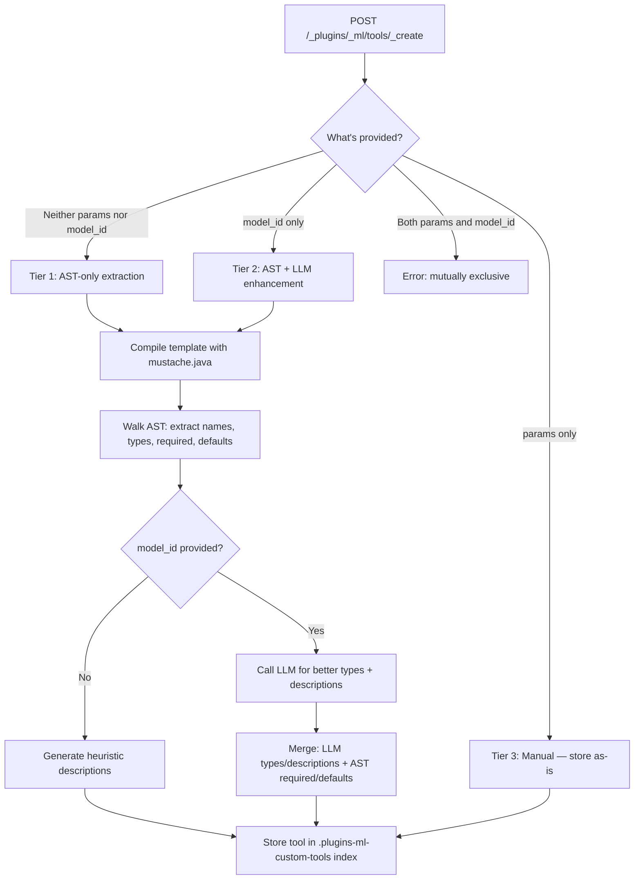
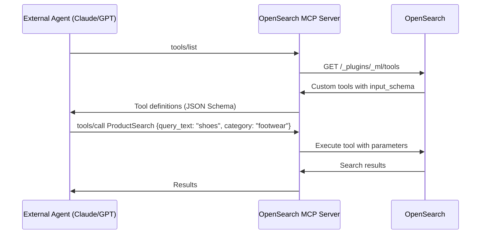
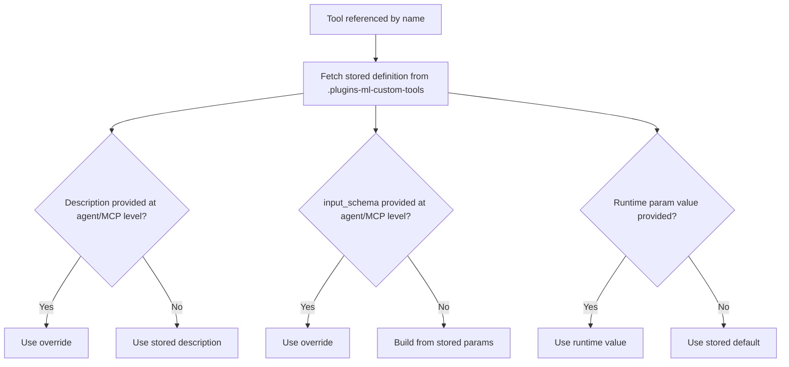
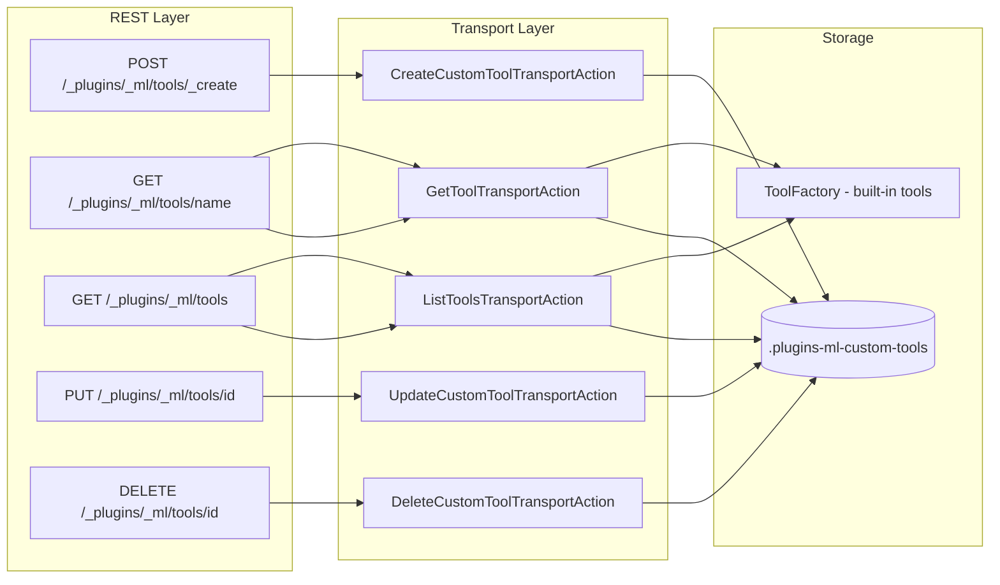
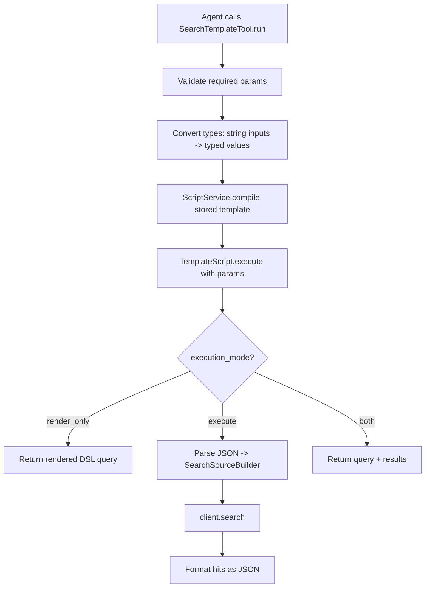

# Custom Tools for ML Agents — Design Document

## 1. Problem Statement

OpenSearch ML agents today have no way to leverage existing search templates. When an agent needs to execute a search, the LLM must generate full OpenSearch DSL from scratch — even when the customer already has a well-tested, parameterized search template that does exactly what's needed. This creates several problems:

- **Wasted tokens and latency:** The LLM receives the full index mapping, sample documents, and template references in its prompt (~4,000-5,000 tokens), then generates a complete DSL query as output (~300 tokens, 2-5 seconds). Most of this work is redundant when a template already defines the query structure.
- **Unreliable output:** The LLM can produce syntactically invalid queries, deviate from the expected query shape, or hallucinate field names that don't exist in the index. There is no guarantee the generated DSL matches the intended search pattern.
- **Expensive models required:** DSL generation is a complex task that demands large, capable models. Smaller, cheaper models cannot reliably produce correct OpenSearch queries.
- **No reuse of existing work:** Customers have invested in building and validating search templates for their use cases — product searches, log filters, geo queries, aggregation pipelines. There is no mechanism to expose these templates as tools that agents can call.

Customers are asking for the ability to take their existing search templates and make them directly usable by agents, without the overhead and risk of full DSL generation.

## 2. Motivation

**The core insight** is that if the search pattern already exists as a template, the LLM's job should reduce to **filling in parameter values** — not generating DSL. Instead of asking the LLM "write me a bool query with a match on title, a term filter on category, and a range on price," we ask it "what is the category, and what is the max price?" The template handles the rest.

This shift has a direct impact on latency. Output tokens are the primary bottleneck in LLM response time (`time_to_last_token = TTFT + output_tokens / tokens_per_second`). Generating full DSL produces ~300 output tokens. Filling parameters via a structured tool call produces ~30 tokens — a 10x reduction that translates to sub-second latency instead of 2-5 seconds. Token cost drops proportionally (~250-500 tokens per request vs ~4,000-5,000), and smaller, cheaper models become viable since parameter extraction is a far simpler task than DSL generation.

Custom tools also open the door for the **Query Planner Tool** to select and invoke tools as sub-plans, and work natively with **MCP servers** for external agent orchestration.

### Example — How This Helps an Agent

Without custom tools, an agent handling *"Find red shoes under $50"* must receive the full index mapping, a sample document, and possibly a template as reference in its prompt. The LLM generates a complete bool query with match, term, and range clauses (~300 output tokens, 2-5s). With a custom tool, the agent sees only: `ProductSearchTool(category: string, color: string, price_max: number)`. The LLM returns a single tool call — `ProductSearch(category="shoes", color="red", price_max=50)` — in ~30 tokens, under 1 second. The template renders the DSL server-side, guaranteeing the correct query structure every time.

## 3. Requirements

**Functional:**
- Users can wrap existing search templates as tools that ML agents can invoke directly
- The system should minimize setup effort — ideally, pointing at a search template is enough to create a usable tool
- Tools must be manageable (create, read, update, delete) and shareable across agents
- Custom tools should appear alongside built-in tools so agents have a unified view of available capabilities
- At runtime, the tool handles template rendering, type conversion, and search execution — the agent only provides parameter values

**Non-Functional:**
- Tool creation should not require an LLM in the default path — customers without deployed models should still benefit
- Tool execution overhead (beyond the search itself) should be negligible

## 4. User Flow

The end-to-end flow involves four steps: creating a search template (standard OpenSearch), registering a custom tool (which auto-extracts parameters and stores the tool definition in a dedicated system index), attaching the tool to an agent, and the agent invoking the tool at runtime. The custom tool definition — including its auto-generated parameter schema — is persisted in the `.plugins-ml-custom-tools` system index, making it reusable across multiple agents.



---

## 5. Approaches for Parameter Definition

For an LLM to use a tool effectively via function calling, the tool must expose a well-defined parameter schema — each parameter needs a name, type, description, and whether it's required. This schema becomes the `input_schema` (JSON Schema) that the agent presents to the LLM as a function definition. Without it, the LLM has no way to know what inputs the tool expects or how to fill them. The question is: who defines these parameters? Four approaches were considered:

### Approach 1: Manual — User Provides Params

The user explicitly defines every parameter in the create request.

```json
POST /_plugins/_ml/tools/_create
{
  "name": "ProductSearchTool",
  "type": "search_template",
  "search_template_name": "product_search",
  "params": {
    "category":  { "type": "string",  "description": "Product category",  "required": true  },
    "price_max": { "type": "number",  "description": "Maximum price",     "required": false }
  }
}
```

**Pros:**
- Full control over every parameter definition
- No surprises — what you write is what gets stored

**Cons:**
- Tedious for customers with 20+ templates
- Error-prone — params must match template variables exactly, typos cause silent failures
- Duplicates information already present in the template

### Approach 2: AST Parsing — Auto-Extract from Template

Compile the Mustache template using the same `mustache.java` library OpenSearch uses, walk the AST, and programmatically extract:
- **Variable names** from `ValueCode`, `ToJsonCode`, `JoinerCode` nodes
- **Required/optional** from section nesting (self-guarding sections, inverted defaults)
- **Types** from DSL context (quoted = string, unquoted = number, toJson = array, section-only = boolean)
- **Default values** from inverted sections (`{{^size}}10{{/size}}` -> default "10")
- **Descriptions** from surrounding DSL context (`"match":{"title":"{{query_text}}"}` -> "Value for the 'title' field (match)")

```json
POST /_plugins/_ml/tools/_create
{
  "name": "ProductSearchTool",
  "type": "search_template",
  "search_template_name": "product_search"
}
// No params, no model_id — system auto-extracts everything
```

**Pros:**
- Zero effort from the user — just provide a template name
- Deterministic and fast (~10ms, no LLM dependency)
- No additional cost — no model needed

**Cons:**
- Descriptions are functional but generic — for example, given the template `"match":{"title":"{{query_text}}"}`, the analyzer generates `"Value for the 'title' field (match)"`. An LLM would produce something more natural like `"Search text to match against product titles using full-text search"`. Similarly, `"size":{{result_size}}` yields `"Value for 'result_size'"` instead of `"Maximum number of search results to return (default 10)"`
- Type inference is heuristic-based — works well for common patterns but may miss edge cases

### Approach 3: AST Parsing + LLM — Use a Model to Enhance Descriptions

Perform the same AST tree walking as Approach 2 to extract variable names, required/optional, and defaults deterministically. Then pass the template source and the extracted variable list to an LLM, asking it to provide richer type inference and human-quality descriptions for each parameter. The LLM does not determine requiredness or extract variables — that's already handled by the AST.

```json
POST /_plugins/_ml/tools/_create
{
  "name": "ProductSearchTool",
  "type": "search_template",
  "search_template_name": "product_search",
  "model_id": "haiku-model-id"
}
```

**Pros:**
- Rich, human-quality descriptions (e.g., "Maximum price in USD for filtering products" instead of "Value for 'price_max'")
- Better type refinement — LLM can distinguish `float` vs `integer` from semantic context

**Cons:**
- Adds latency (1-3s for the LLM call) to tool creation
- Requires a deployed model — not always available
- Non-deterministic — same template may produce slightly different descriptions across calls
- Hallucination risk on types (mitigated by AST handling required/optional)

### Approach 4 (Recommended): Hybrid — All Three Paths Available

Expose all three approaches as tiers within a single API. The user chooses their level of involvement:

- **Tier 1 (default):** Provide nothing extra — the system auto-extracts everything from the template AST (Approach 2)
- **Tier 2:** Provide a `model_id` — the system auto-extracts via AST, then enhances descriptions with the LLM (Approach 3)
- **Tier 3:** Provide `params` manually — the system stores them as-is, no extraction (Approach 1)

This way, customers who want zero friction get it (Tier 1), customers who want polished descriptions can opt in (Tier 2), and customers who want full control can provide their own params (Tier 3). After creation via any tier, users can always correct or refine params via the `PUT` update API.



**Key principle:** The LLM never determines required/optional — that's structural, not semantic. The AST tells us definitively whether a variable is inside a conditional section. The LLM's role is limited to enriching descriptions and refining types — things it's good at and that are easily reviewable.

---

## 6. Define Once, Use Everywhere

A core design goal is that once a tool is registered, it can be used across every surface in the ML framework — the Execute API, agents, and MCP servers — with minimal configuration. The stored tool definition carries everything needed: the search template reference, parameter schema, and description. Consumers reference the tool by **name** and the system resolves the rest.

### 6.1 Direct Execution

For testing or programmatic use, tools can be executed directly without an agent:

```bash
POST /_plugins/_ml/tools/_execute/SearchTemplateTool
{
  "name": "ProductSearch",
  "parameters": {
    "query_text": "wireless headphones",
    "category": "electronics"
  }
}
```

The `name` field tells the system to look up the stored tool definition. Runtime `parameters` are merged with stored defaults — if the tool has `size` defaulting to 20 and the caller doesn't provide it, 20 is used.

### 6.2 Agents

Attaching a custom tool to an agent requires just the type and name. The agent auto-fetches the tool's description and `input_schema` from the stored definition, so the LLM knows what parameters to fill:

```bash
POST /_plugins/_ml/agents/_register
{
  "name": "Shopping Assistant",
  "type": "conversational",
  "llm": { "model_id": "my-model" },
  "tools": [
    {
      "type": "SearchTemplateTool",
      "name": "ProductSearch"
    }
  ]
}
```

No need to repeat the search template name, parameter definitions, or description — it's all resolved from the stored tool. If needed, the description and `input_schema` can be overridden at the agent level for context-specific tuning (e.g., giving the LLM more specific instructions for a particular agent's use case).

### 6.3 MCP Server

Custom tools are also exposed via the OpenSearch MCP Server, allowing external agents (Claude, GPT, Cursor, etc.) to discover and invoke them through the Model Context Protocol:



The `input_schema` auto-generated from parameter definitions is already valid JSON Schema, which is exactly what MCP expects. The MCP server simply proxies tool definitions and invocations — no additional configuration needed per tool.

### 6.4 Resolution Strategy

When a tool is referenced by name, the system resolves each field using a fallback chain:



This layering means a single tool definition serves multiple agents with different prompting strategies, while the underlying search template and parameter schema remain consistent.

---

## 7. Low-Level Implementation

### 7.1 System Index: `.plugins-ml-custom-tools`

Custom tools are stored in a dedicated system index, following the same pattern as connectors, models, and agents.

**Index mapping:**

| Field | Type | Notes |
|---|---|---|
| `name` | text + keyword | Unique, validated at create time |
| `description` | text + keyword | Max 512 chars |
| `type` | keyword | Currently restricted to `"search_template"` |
| `search_template_name` | keyword | Reference to stored script |
| `params` | flat_object | Parameter definitions (name -> {type, description, required, default}) |
| `model_id` | keyword | Optional, for Tier 2 LLM enhancement |
| `tenant_id` | keyword | Multi-tenancy support |
| `create_time` | date | Auto-set |
| `last_update_time` | date | Auto-set on create/update |

### 7.2 CRUD API



**GET/LIST merges built-in and custom tools** into a single response. Built-in tools take precedence on name conflicts.

### 7.3 SearchTemplateTool Execution

The tool renders Mustache templates via `ScriptService` (OpenSearch core), avoiding any direct dependency on the `lang-mustache` module.



**Type conversion** at runtime: LLMs pass all values as strings. The tool converts based on param definitions (`"5"` -> `5` for integer fields) to produce valid JSON.

**Execution modes:**
- `execute` (default) — render + search + return results
- `render_only` — render + return the DSL query (debugging/transparency)
- `both` — render + search + return both

### 7.4 MustacheTemplateAnalyzer (AST Walker)

The analyzer compiles the template with `mustache.java` (same library OpenSearch uses: `com.github.spullara.mustache.java:compiler:0.9.14`) and recursively walks the Code tree.

**How it handles each AST node type:**

| Node Type | Example | Extraction |
|---|---|---|
| `ValueCode` | `{{query_text}}` | Variable name, type from surrounding text context |
| `IterableCode` | `{{#genre}}...{{/genre}}` | Section controller (boolean if no inner value usage) |
| `NotIterableCode` | `{{^size}}10{{/size}}` | Inverted default → `required: false`, `default: "10"` |
| `ToJsonCode` | `{{#toJson}}tags{{/toJson}}` | Array type |
| `JoinerCode` | `{{#join}}emails{{/join}}` | Array type |
| `UrlEncoderCode` | `{{#url}}...{{/url}}` | Transparent — recurse into children |
| `WriteCode` | Literal text | Captured as `precedingText` for type/description inference |

**Type inference from preceding literal text:**
- Ends with `"` → `string` (quoted value in DSL)
- Ends with `:` or `,` → `number` (bare value position)
- Inside toJson/join helper → `array`
- Section controller with no value usage → `boolean`

**Required/optional logic:**
- Has inverted default (`{{^var}}default{{/var}}`) → **optional**
- Section controller only (no `{{var}}` usage) → **optional** (boolean flag)
- Appears only inside own section (`{{#var}}...{{var}}...{{/var}}`) → **optional** (self-guarding)
- Appears at root scope with none of the above → **required**

### 7.5 Validation Rules

| Rule | When | Error |
|---|---|---|
| Name required | Create | `Custom tool name is required` |
| Name unique | Create | `A custom tool with name '...' already exists` |
| Name no `_` prefix | Create | `Custom tool name cannot start with '_'` |
| Type = `search_template` | Create | `Custom tool type must be 'search_template'` |
| Template exists | Create | `Search template '...' not found` |
| params XOR model_id | Create | `Cannot specify both 'params' and 'model_id'` |
| Required params present | Runtime | `Missing required parameters` |

### 7.6 Files

**New files (17):** Index mapping, data model (`MLCustomToolInput`), transport actions/requests/responses for Create/Update/Delete, `SearchTemplateTool` + Factory, `MustacheTemplateAnalyzer`, REST handlers, `CustomToolsHelper`.

**Modified files (6):** `CommonValue` (constants), `MLIndex` (enum entry), `MLIndicesHandler` (init index), `GetToolTransportAction` (fallback to custom tools), `ListToolsTransportAction` (merge custom tools), `MachineLearningPlugin` (register everything).

---

## 8. Appendix

### 8.1 POC Branch

**Branch:** [`feature/custom-tools`](https://github.com/rithin-pullela-aws/ml-commons/tree/feature/custom-tools)

A full end-to-end Postman collection is available at [`scripts/e2e_test/Custom_Tools_API.postman_collection.json`](scripts/e2e_test/Custom_Tools_API.postman_collection.json) covering all three tiers, direct execution, agent integration, MCP, and RBAC. Below is a walkthrough of the key flows.

#### Step 1: Create search templates

```bash
# Product search — match on title, optional category filter, pagination with defaults
PUT /_scripts/product_search
{
  "script": {
    "lang": "mustache",
    "source": "{\"query\":{\"bool\":{\"must\":[{\"match\":{\"title\":\"{{query_text}}\"}}]{{#category}},\"filter\":[{\"term\":{\"category\":\"{{category}}\"}}]{{/category}}}},\"from\":{{#from}}{{from}}{{/from}}{{^from}}0{{/from}},\"size\":{{#size}}{{size}}{{/size}}{{^size}}20{{/size}}}"
  }
}

# Log search — date range with optional level filter
PUT /_scripts/log_search
{
  "script": {
    "lang": "mustache",
    "source": "{\"query\":{\"bool\":{\"must\":[{\"range\":{\"timestamp\":{\"gte\":\"{{start_date}}\",\"lte\":\"{{end_date}}\"}}}{{#level}},{\"term\":{\"level\":\"{{level}}\"}}{{/level}}]}},\"size\":{{#size}}{{size}}{{/size}}{{^size}}50{{/size}}}"
  }
}

# Geo search — location name within radius
PUT /_scripts/geo_search
{
  "script": {
    "lang": "mustache",
    "source": "{\"query\":{\"bool\":{\"must\":[{\"match\":{\"name\":\"{{search_text}}\"}}],\"filter\":[{\"geo_distance\":{\"distance\":\"{{radius}}\",\"location\":{\"lat\":{{lat}},\"lon\":{{lon}}}}}]}},\"size\":{{#size}}{{size}}{{/size}}{{^size}}10{{/size}}}"
  }
}
```

#### Step 2: Register custom tools (one per tier)

```bash
# Tier 1 — AST auto-extract (no params, no model_id)
POST /_plugins/_ml/tools/_create
{
  "name": "ProductSearch",
  "description": "Search products by title with optional category filter and pagination",
  "type": "search_template",
  "search_template_name": "product_search",
  "index": "products"
}

# Tier 2 — AST + LLM enrichment (provide model_id)
POST /_plugins/_ml/tools/_create
{
  "name": "LogSearch",
  "description": "Search logs by date range with optional level filter",
  "type": "search_template",
  "search_template_name": "log_search",
  "index": "logs",
  "model_id": "<your-model-id>",
  "llm_interface": "bedrock/converse/claude"
}

# Tier 3 — Manual params (full control)
POST /_plugins/_ml/tools/_create
{
  "name": "GeoSearch",
  "description": "Search locations by name within a geographic radius",
  "type": "search_template",
  "search_template_name": "geo_search",
  "index": "locations",
  "params": {
    "search_text": { "type": "string", "description": "Search text for location name", "required": true },
    "radius":      { "type": "string", "description": "Search radius (e.g., '10km')", "required": true },
    "lat":         { "type": "number", "description": "Latitude of center point", "required": true },
    "lon":         { "type": "number", "description": "Longitude of center point", "required": true },
    "size":        { "type": "number", "description": "Max results to return", "required": false, "default": "10" }
  }
}
```

#### Step 3: Execute tools directly

```bash
# Product search — basic
POST /_plugins/_ml/tools/_execute/SearchTemplateTool
{ "name": "ProductSearch", "parameters": { "query_text": "wireless headphones", "size": "5" } }

# Product search — with category filter
POST /_plugins/_ml/tools/_execute/SearchTemplateTool
{ "name": "ProductSearch", "parameters": { "query_text": "laptop", "category": "electronics", "size": "3" } }

# Geo search — coffee shops in NYC
POST /_plugins/_ml/tools/_execute/SearchTemplateTool
{ "name": "GeoSearch", "parameters": { "search_text": "coffee shop", "radius": "5km", "lat": "40.7128", "lon": "-74.0060" } }

# Log search — date range
POST /_plugins/_ml/tools/_execute/SearchTemplateTool
{ "name": "LogSearch", "parameters": { "start_date": "2024-01-01", "end_date": "2024-12-31" } }
```

#### Step 4: Register an agent with custom tools

```bash
POST /_plugins/_ml/agents/_register
{
  "name": "ShoppingAssistant",
  "type": "conversational",
  "tools": [
    { "type": "SearchTemplateTool", "name": "ProductSearch" },
    { "type": "ListIndexTool" }
  ],
  "llm": {
    "model_id": "<your-model-id>",
    "parameters": { "prompt": "${parameters.question}" }
  },
  "parameters": { "_llm_interface": "bedrock/converse/claude" },
  "memory": { "type": "conversation_index" }
}

# Ask the agent a question — it picks ProductSearch via function calling
POST /_plugins/_ml/agents/<agent_id>/_execute
{ "parameters": { "question": "Find me wireless headphones", "verbose": "true" } }
```

#### Step 5: Expose via MCP Server

```bash
# Register the tool with MCP
POST /_plugins/_ml/mcp/tools/_register
{ "tools": [{ "type": "SearchTemplateTool", "name": "ProductSearch" }] }

# External agents discover tools via MCP protocol
POST /_plugins/_ml/mcp
{ "jsonrpc": "2.0", "id": 2, "method": "tools/list", "params": {} }

# External agents call tools via MCP protocol
POST /_plugins/_ml/mcp
{
  "jsonrpc": "2.0", "id": 3, "method": "tools/call",
  "params": { "name": "ProductSearch", "arguments": { "query_text": "headphones", "category": "electronics" } }
}
```

### 8.2 Test Results Summary

40 templates tested covering: basic variables, inverted defaults, toJson arrays, self-guarding sections, boolean guards, nested scopes, dot notation, triple braces, helpers (join/url/toJson), and a 15-parameter e-commerce template.

| Category | Templates | Params Extracted | Arrays | Booleans | Defaults |
|---|---|---|---|---|---|
| Basic & pagination | 5 | 18 | 1 | 0 | 7 |
| Filters & guards | 8 | 35 | 3 | 3 | 9 |
| Helpers & edge cases | 12 | 28 | 8 | 2 | 6 |
| Complex real-world | 15 | 60+ | 6 | 4 | 15 |

Full results: [PARAM_AUTO_GENERATION_TEST_RESULTS.md](PARAM_AUTO_GENERATION_TEST_RESULTS.md)

### 8.3 Implementation Status

The feature is being rolled out in phases:

| Phase | Scope | Status |
|---|---|---|
| **Phase 1** | CRUD APIs, system index, SearchTemplateTool, MustacheTemplateAnalyzer (auto-extraction), Tool Execute API with name-based resolution | Done |
| **Phase 2** | Name-based resolution in Agents and MCP — async `createTools()` with `CustomToolResolver`, override/fallback chain | Done |
| **Phase 3** | Access control — `backend_roles`, `access_mode` (`public`/`private`/`restricted`), modeled on the existing connector RBAC pattern | Done |

### 8.4 Phase 3 — RBAC Implementation Details

Phase 3 adds role-based access control (RBAC) for custom tools, following the same pattern used by connectors (`ConnectorAccessControlHelper`).

**Cluster setting:** `plugins.ml_commons.custom_tool_access_control_enabled` (dynamic, default `false`)

**Access modes:**
- `public` — any user can discover and use the tool (read-only; only owner/admin can update/delete)
- `private` — only the owner can see, update, or delete
- `restricted` — only users with matching backend roles can discover; only owner/admin can update/delete

**Index mapping changes:** Added `backend_roles` (text+keyword), `access` (keyword), and `owner` (nested object with name, backend_roles, roles, custom_attribute_names) to `.plugins-ml-custom-tools`.

**New files:**
- `CustomToolAccessControlHelper` — validates create requests, checks permissions on CRUD, adds search filters for list/get
- E2E test script: `test_rbac_custom_tools.sh`

**Modified files:**
- `MLCustomToolInput` — added `backendRoles`, `addAllBackendRoles`, `access`, `owner` fields with full serialization
- `MLCommonsSettings` — added `ML_COMMONS_CUSTOM_TOOL_ACCESS_CONTROL_ENABLED`
- `CreateCustomToolTransportAction` — validates RBAC params, sets owner on creation
- `UpdateCustomToolTransportAction` — fetch-then-validate pattern (checks ownership before allowing update)
- `DeleteCustomToolTransportAction` — fetch-then-validate pattern (checks ownership before allowing delete)
- `CustomToolsHelper` — applies search filters so list/get respects access modes
- `CustomToolResolver` — checks access via `BiConsumer<User, Map>` pattern (cross-module bridge)
- `MachineLearningPlugin` — wires up `CustomToolAccessControlHelper`, registers setting

**Key design decisions:**
- User context is captured BEFORE `stashContext()` since stashing clears thread-context transients
- Cross-module access checking uses `BiConsumer<User, Map<String, Object>>` since `ml-algorithms` cannot import plugin classes
- Tools created before RBAC was enabled (no `owner` field) are treated as public for backward compatibility
- Admin users (`all_access` role) bypass all access checks

### 8.5 Future Work

1. **Tier 2 LLM enhancement** — Wire up `MachineLearningNodeClient.predict()` for richer descriptions
2. **Additional tool types** — `http_connector`, `script` (painless), etc.
3. **Search API** — `POST /_plugins/_ml/tools/_search` for querying custom tools
