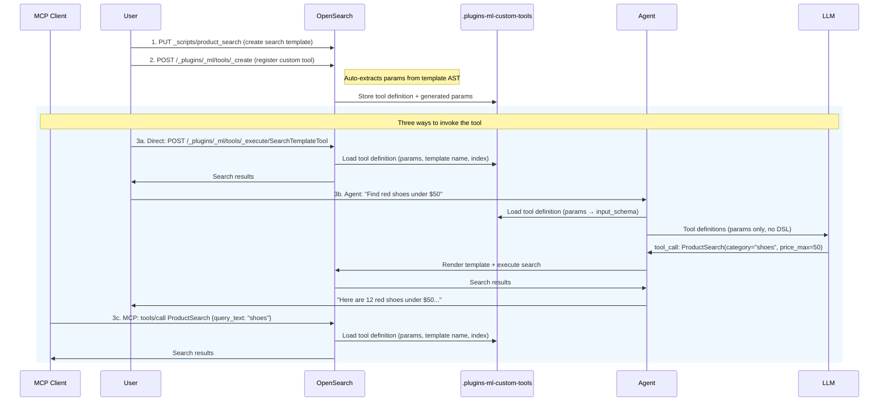
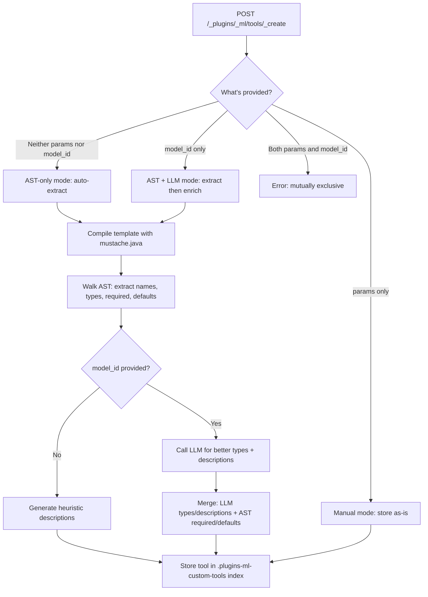
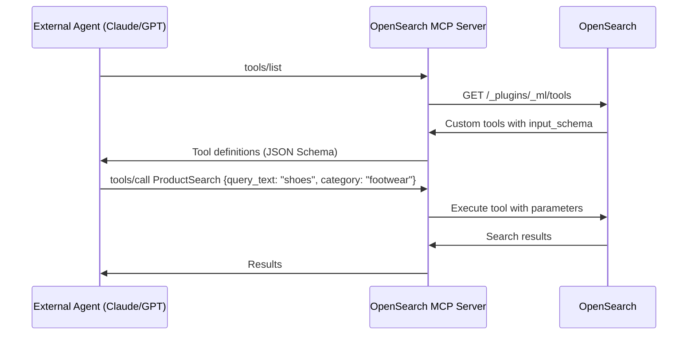
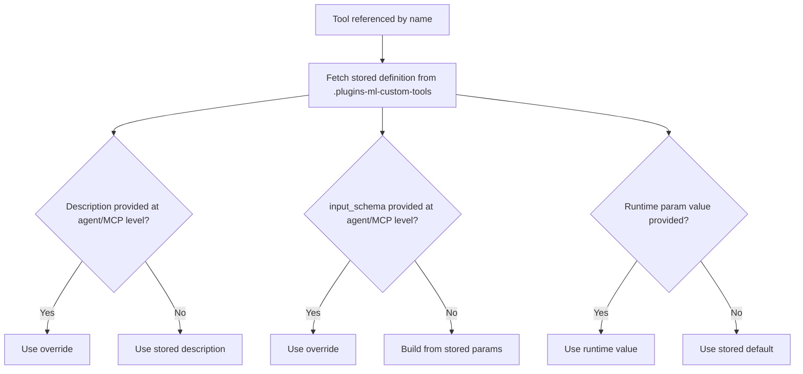

# Custom Tools for ML Agents — Design Document

## 1. Problem Statement

OpenSearch ML agents today have no way to leverage existing search templates. When an agent needs to execute a search, the LLM must generate full OpenSearch DSL from scratch — even when the customer already has a well-tested, parameterized search template that does exactly what's needed. This creates several problems:

- **Wasted tokens and latency:** The LLM spends most of its work generating query structure that a template already defines.
- **Unreliable output:** The LLM can produce syntactically invalid queries, deviate from the expected query shape, or hallucinate field names that don't exist in the index.
- **Expensive models required:** DSL generation is a complex task that demands large, capable models. Smaller, cheaper models cannot reliably produce correct OpenSearch queries.
- **No reuse of existing work:** Customers have invested in building and validating search templates for their use cases — product searches, log filters, geo queries, aggregation pipelines. There is no mechanism to expose these templates as tools that agents can call.

Customers are asking for the ability to take their existing search templates and make them directly usable by agents, without the overhead and risk of full DSL generation.

## 2. Motivation

**The core insight** is that if the search pattern already exists as a template, the LLM's job should reduce to **filling in parameter values** — not generating DSL. Instead of asking the LLM "write me a bool query with a match on title, a term filter on category, and a range on price," we ask it "what is the category, and what is the max price?" The template handles the rest.

This shift has a direct impact on latency. Output tokens are the primary bottleneck in LLM response time (`time_to_last_token = TTFT + output_tokens / tokens_per_second`). Generating full DSL produces ~300 output tokens. Filling parameters via a structured tool call produces ~30 tokens — a 10x reduction that translates to sub-second latency instead of 2-5 seconds. Token cost drops proportionally (~250-500 tokens per request vs ~4,000-5,000), and smaller, cheaper models become viable since parameter extraction is a far simpler task than DSL generation.

Custom tools also open the door for the **Query Planner Tool** to select and invoke tools as sub-plans, and work natively with **MCP servers** for external agent orchestration.

### Example — How This Helps an Agent

Without custom tools, an agent handling *"Find red shoes under $50"* must receive the full index mapping, a sample document, and possibly a template as reference in its prompt. The LLM generates a complete bool query with match, term, and range clauses (~300 output tokens, 2-5s). With a custom tool, the agent sees only: `ProductSearchTool(category: string, color: string, price_max: number)`. The LLM returns a single tool call — `ProductSearch(category="shoes", color="red", price_max=50)` — in ~30 tokens, under 1 second. The template renders the DSL server-side, guaranteeing the correct query structure every time.

## 3. Requirements

**Functional:**
- Users can wrap existing search templates as tools that ML agents can invoke directly
- The system should minimize setup effort — ideally, pointing at a search template is enough to create a usable tool
- Tools must be manageable (create, read, update, delete) and shareable across agents
- Custom tools should appear alongside built-in tools so agents have a unified view of available capabilities
- At runtime, the tool handles template rendering, type conversion, and search execution — the agent only provides parameter values

**Non-Functional:**
- Tool creation should not require an LLM in the default path — customers without deployed models should still benefit
- Tool execution overhead (beyond the search itself) should be negligible

## 4. User Flow

The flow starts with creating a search template (standard OpenSearch), then registering a custom tool (which auto-extracts parameters and stores the definition in a dedicated system index). Once registered, the tool can be invoked in three ways: directly via the Execute API, attached to an ML agent, or exposed to external clients through the MCP server. The custom tool definition — including its auto-generated parameter schema — is persisted in the `.plugins-ml-custom-tools` system index, making it reusable across all three surfaces. The next section explores how parameters are defined during the creation step.



---

## 5. Approaches for Parameter Definition

For an LLM to use a tool effectively via function calling, the tool must expose a well-defined parameter schema — each parameter needs a name, type, description, and whether it's required. This schema becomes the `input_schema` (JSON Schema) that the agent presents to the LLM as a function definition. Without it, the LLM has no way to know what inputs the tool expects or how to fill them. The question is: who defines these parameters? Four approaches were considered:

### Approach 1: Manual — User Provides Params

The user explicitly defines every parameter in the create request.

```json
POST /_plugins/_ml/tools/_create
{
  "name": "ProductSearchTool",
  "type": "search_template",
  "search_template_name": "product_search",
  "params": {
    "category":  { "type": "string",  "description": "Product category",  "required": true  },
    "price_max": { "type": "number",  "description": "Maximum price",     "required": false }
  }
}
```

**Pros:**
- Full control over every parameter definition
- No surprises — what you write is what gets stored

**Cons:**
- Tedious for customers with 20+ templates
- Error-prone — params must match template variables exactly, typos cause silent failures
- Duplicates information already present in the template

### Approach 2: AST Parsing — Auto-Extract from Template

When OpenSearch renders a search template, it compiles the Mustache source into an **Abstract Syntax Tree (AST)** — a tree of typed nodes representing each element of the template (variables, sections, helpers, literal text). OpenSearch core already walks this AST internally to extract variable names for template validation. The insight behind this approach is that the AST contains far more information than just variable names: the node types, nesting structure, and surrounding literal text encode the variable's type, whether it's required, its default value, and what DSL context it appears in. We take the same `mustache.java` library (`com.github.spullara.mustache.java:compiler:0.9.14`) that OpenSearch uses, compile the template, and walk the AST one step further to programmatically extract:
- **Variable names** from `ValueCode`, `ToJsonCode`, `JoinerCode` nodes
- **Required/optional** from section nesting (self-guarding sections, inverted defaults)
- **Types** from DSL context (quoted = string, unquoted = number, toJson = array, section-only = boolean)
- **Default values** from inverted sections (`{{^size}}10{{/size}}` -> default "10")
- **Descriptions** from surrounding DSL context (`"match":{"title":"{{query_text}}"}` -> "Value for the 'title' field (match)")

```json
POST /_plugins/_ml/tools/_create
{
  "name": "ProductSearchTool",
  "type": "search_template",
  "search_template_name": "product_search"
}
// No params, no model_id — system auto-extracts everything
```

**Pros:**
- Zero effort from the user — just provide a template name
- Deterministic and fast (~10ms, no LLM dependency)
- No additional cost — no model needed

**Cons:**
- Descriptions are functional but generic. For example, given the DSL context:
  ```json
  {
    "query": {
      "match": { "title": "{{query_text}}" }
    },
    "size": "{{result_size}}"
  }
  ```
  The analyzer generates:
  - `query_text` → `"Value for the 'title' field (match)"`
  - `result_size` → `"Value for 'result_size'"`

  Good enough for a developer to understand, but not the human-quality descriptions you'd want an LLM to see in a tool's input schema
- Type inference is heuristic-based — works well for common patterns but may miss edge cases

### Approach 3: AST Parsing + LLM — Use a Model to Enhance Descriptions

Perform the same AST tree walking as Approach 2 to extract variable names, required/optional, and defaults deterministically. Then pass the template source and the extracted variable list to an LLM, asking it to provide richer type inference and human-quality descriptions for each parameter. The LLM does not determine requiredness or extract variables — that's already handled by the AST.

```json
POST /_plugins/_ml/tools/_create
{
  "name": "ProductSearchTool",
  "type": "search_template",
  "search_template_name": "product_search",
  "model_id": "haiku-model-id"
}
```

**Pros:**
- Rich, human-quality descriptions (e.g., "Maximum price in USD for filtering products" instead of "Value for 'price_max'")
- Better type refinement — LLM can distinguish `float` vs `integer` from semantic context

**Cons:**
- Adds latency (1-3s for the LLM call) to tool creation
- Requires a deployed model — not always available
- Non-deterministic — same template may produce slightly different descriptions across calls
- Hallucination risk on types (mitigated by AST handling required/optional)

### Approach 4 (Recommended): Hybrid — All Three Paths Available

Expose all three approaches as modes within a single API. The user chooses their level of involvement:

- **AST-only mode (default):** Provide nothing extra — the system auto-extracts everything from the template AST (Approach 2)
- **AST + LLM mode:** Provide a `model_id` — the system auto-extracts via AST, then enhances descriptions with the LLM (Approach 3)
- **Manual mode:** Provide `params` — the system stores them as-is, no extraction (Approach 1)

This way, customers who want zero friction get it, customers who want polished descriptions can opt in, and customers who want full control can provide their own params. After creation via any path, users can always correct or refine params via the `PUT` update API.



**Key principle:** The LLM never determines required/optional — that's structural, not semantic. The AST tells us definitively whether a variable is inside a conditional section. The LLM's role is limited to enriching descriptions and refining types — things it's good at and that are easily reviewable.

---

## 6. Implementation Overview

### 6.1 System Index: `.plugins-ml-custom-tools`

Custom tools are stored in a dedicated system index, following the same pattern as connectors, models, and agents.

```json
{
  "_meta": { "schema_version": 3 },
  "properties": {
    "name":                  { "type": "text", "fields": { "keyword": { "type": "keyword" } } },
    "description":           { "type": "text", "fields": { "keyword": { "type": "keyword", "ignore_above": 512 } } },
    "type":                  { "type": "keyword" },
    "search_template_name":  { "type": "keyword" },
    "index":                 { "type": "keyword" },
    "params":                { "type": "flat_object" },
    "backend_roles":         { "type": "text", "fields": { "keyword": { "type": "keyword" } } },
    "access":                { "type": "keyword" },
    "owner":                 { "type": "nested", "properties": { "name": {}, "backend_roles": {}, "roles": {}, "custom_attribute_names": {} } },
    "tenant_id":             { "type": "keyword" },
    "created_time":          { "type": "date", "format": "strict_date_time||epoch_millis" },
    "last_updated_time":     { "type": "date", "format": "strict_date_time||epoch_millis" }
  }
}
```

Full mapping: [ml_custom_tools.json](common/src/main/resources/index-mappings/ml_custom_tools.json)

CRUD operations follow the standard OpenSearch ML pattern: `POST /_plugins/_ml/tools/_create`, `GET /_plugins/_ml/tools/{name_or_id}`, `GET /_plugins/_ml/tools` (list), `PUT /_plugins/_ml/tools/{name_or_id}`, `DELETE /_plugins/_ml/tools/{name_or_id}`. The GET and LIST endpoints merge built-in tools (from `ToolFactory`) with custom tools from the index into a single response, with built-in tools taking precedence on name conflicts.

### 6.2 Key Components

- **`SearchTemplateTool`** — Renders Mustache templates via `ScriptService` (OpenSearch core) and executes the search. Handles type conversion at runtime (LLMs pass all values as strings; the tool converts based on param definitions).
- **`MustacheTemplateAnalyzer`** — Compiles templates with `mustache.java` (same library OpenSearch uses) and walks the AST to extract parameter names, types, required/optional status, defaults, and descriptions. See Section 6.3 for details.
- **`LLMParameterEnricher`** — AST + LLM mode enrichment. Takes AST-extracted parameters and the template source, builds a dynamic JSON Schema where each parameter name is a string property, and issues a forced function call to the configured LLM asking it to return a description for each parameter. The LLM response (`{paramName: "description", ...}`) is merged back into the AST-extracted definitions — only descriptions and types are updated, while required/optional and defaults are preserved from the AST. Supports OpenAI, Bedrock, and Gemini function calling interfaces via `FunctionCallingFactory`.
- **`CustomToolResolver`** — Async name-based lookup from the system index. Used by `MLToolExecutor` (Execute API), `AgentUtils.createTools()` (agents), and `McpToolsHelper` (MCP server) to resolve a tool name into its full definition.
- **`CustomToolAccessControlHelper`** — RBAC enforcement on CRUD operations. See Section 6.4.

### 6.3 MustacheTemplateAnalyzer (AST Walker)

The analyzer compiles the template with `mustache.java` (`com.github.spullara.mustache.java:compiler:0.9.14`) and recursively walks the Code tree.

**How it handles each AST node type:**

| Node Type | Example | Extraction |
|---|---|---|
| `ValueCode` | `{{query_text}}` | Variable name, type from surrounding text context |
| `IterableCode` | `{{#genre}}...{{/genre}}` | Section controller (boolean if no inner value usage) |
| `NotIterableCode` | `{{^size}}10{{/size}}` | Inverted default → `required: false`, `default: "10"` |
| `ToJsonCode` | `{{#toJson}}tags{{/toJson}}` | Array type |
| `JoinerCode` | `{{#join}}emails{{/join}}` | Array type |
| `UrlEncoderCode` | `{{#url}}...{{/url}}` | Transparent — recurse into children |
| `WriteCode` | Literal text | Captured as `precedingText` for type/description inference |

**Type inference from preceding literal text:**
- Ends with `"` → `string` (quoted value in DSL)
- Ends with `:` or `,` → `number` (bare value position)
- Inside toJson/join helper → `array`
- Section controller with no value usage → `boolean`

**Required/optional logic:**
- Has inverted default (`{{^var}}default{{/var}}`) → **optional**
- Section controller only (no `{{var}}` usage) → **optional** (boolean flag)
- Appears only inside own section (`{{#var}}...{{var}}...{{/var}}`) → **optional** (self-guarding)
- Appears at root scope with none of the above → **required**

### 6.4 RBAC

A custom tool definition encapsulates sensitive details — which index to query, which search template to invoke, and how user-facing parameters map to the underlying DSL. Exposing or modifying a tool can effectively grant access to data the caller might not otherwise reach. For this reason, custom tools support the same role-based access control model used by connectors and model groups, gated by the `plugins.ml_commons.custom_tool_access_control_enabled` cluster setting (default `false`). When enabled, each tool has an access mode — `public` (visible to all), `private` (owner only), or `restricted` (visible to users with matching `backend_roles`) — and ownership is captured at creation time. Admin users bypass access checks, and tools created before RBAC was enabled default to public for backward compatibility.

---

## 7. Define Once, Use Everywhere

A core design goal is that once a tool is registered, it can be used across every surface in the ML framework — the Execute API, agents, and MCP servers — with minimal configuration. The stored tool definition carries everything needed: the search template reference, parameter schema, and description. Consumers reference the tool by **name** and the system resolves the rest.

### 7.1 Direct Execution

For testing or programmatic use, tools can be executed directly without an agent:

```bash
POST /_plugins/_ml/tools/_execute/SearchTemplateTool
{
  "name": "ProductSearch",
  "parameters": {
    "query_text": "wireless headphones",
    "category": "electronics"
  }
}
```

The `name` field tells the system to look up the stored tool definition. Runtime `parameters` are merged with stored defaults — if the tool has `size` defaulting to 20 and the caller doesn't provide it, 20 is used.

### 7.2 Agents

Attaching a custom tool to an agent requires just the type and name. The agent auto-fetches the tool's description and `input_schema` from the stored definition, so the LLM knows what parameters to fill:

```bash
POST /_plugins/_ml/agents/_register
{
  "name": "Shopping Assistant",
  "type": "conversational",
  "llm": { "model_id": "my-model" },
  "tools": [
    {
      "type": "SearchTemplateTool",
      "name": "ProductSearch"
    }
  ]
}
```

No need to repeat the search template name, parameter definitions, or description — it's all resolved from the stored tool. If needed, the description and `input_schema` can be overridden at the agent level for context-specific tuning (e.g., giving the LLM more specific instructions for a particular agent's use case).

### 7.3 MCP Server

Custom tools are also exposed via the OpenSearch MCP Server, allowing external agents (Claude, GPT, Cursor, etc.) to discover and invoke them through the Model Context Protocol:



The `input_schema` auto-generated from parameter definitions is already valid JSON Schema, which is exactly what MCP expects. The MCP server simply proxies tool definitions and invocations — no additional configuration needed per tool.

### 7.4 Resolution Strategy

When a tool is referenced by name, the system resolves each field using a fallback chain:



This layering means a single tool definition serves multiple agents with different prompting strategies, while the underlying search template and parameter schema remain consistent.

---

## 8. Testing & Validation

The AST auto-extraction was validated against 40 Mustache templates covering basic variables, inverted defaults, toJson arrays, self-guarding sections, boolean guards, nested scopes, and more. Full results: [PARAM_AUTO_GENERATION_TEST_RESULTS.md](PARAM_AUTO_GENERATION_TEST_RESULTS.md)

---

## 9. Appendix

### 9.1 POC Branch

**Branch:** [`feature/custom-tools`](https://github.com/rithin-pullela-aws/ml-commons/tree/feature/custom-tools)

A full end-to-end Postman collection is available at [`scripts/e2e_test/Custom_Tools_API.postman_collection.json`](scripts/e2e_test/Custom_Tools_API.postman_collection.json). It covers setup (search templates + test data), all three modes of tool creation, direct execution, agent integration, MCP server flows, RBAC, and cleanup.

### 9.2 Implementation Status

| Phase | Scope | Status |
|---|---|---|
| **Phase 1** | CRUD APIs, system index, SearchTemplateTool, MustacheTemplateAnalyzer, Tool Execute API with name-based resolution | Done |
| **Phase 2** | Name-based resolution in Agents and MCP — async `createTools()` with `CustomToolResolver`, override/fallback chain | Done |
| **Phase 3** | Access control — `backend_roles`, `access_mode` (`public`/`private`/`restricted`), modeled on the existing connector/model group RBAC pattern | Done |

### 9.3 Future Work

1. **Additional tool types** — `http_connector`, `script` (painless), etc.
2. **Search API** — `POST /_plugins/_ml/tools/_search` for querying custom tools
